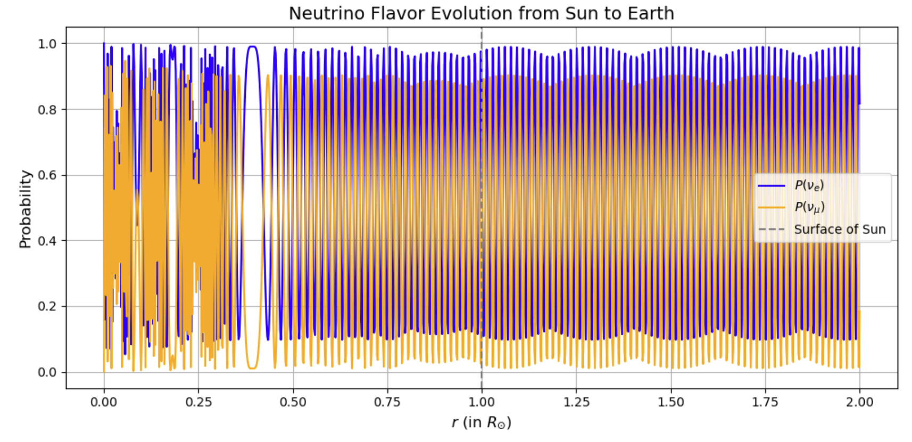

# 2-flavor-solar-neutrino-oscillation
This Python code calculates and visualizes the flavor evolution of solar neutrinos  as they travel from the Sun to Earth.  It uses a 2-flavor neutrino model with vacuum and matter effects, based on the BP2000  solar electron density model.


Main Features:
- Compute the neutrino Hamiltonian including vacuum oscillations and matter potential.
- Solve the Schrödinger equation for neutrino flavor evolution.
- Calculate flavor probabilities P(ν_e) and P(ν_μ) at user-specified distances.
- Plot the survival and transition probabilities versus distance.

Usage:
- Adjust the neutrino energy (E_nu) and evaluation points (r_eval) as needed.
- Ensure the BP2000 electron density model file is available.
- Run the script to obtain probability curves and visualize the results.
"""

## Solar Electron Density

We use unit factor (See [Unit Factor]((#unit-factor-notes)) for more details.) in order to convert eV to m⁻¹

### Reading Electron Density (Mode 1: Custom Model)

Function: custom_density_function()

- You can define your own electron density model as needed.
- You can generate evenly spaced points from the solar center to the solar surface.

```python
# Example usage
r_vals, Ne_vals, success = solar_electron_density(model="custom")

```

### Reading Electron Density (Mode 2: BP2000) 

Function: solar_electron_density()

- Density profile from John Bahcall's website (https://www.sns.ias.edu/~jnb/SNdata/sndata.html)

- Reads the standard BP2000 solar model data from a file for each point.

- Converts the read data into electron density values.

- Uses Avogadro's number (N_A) for unit conversion.

- The electron density unit here is cm⁻³.

```python
# Example usage
r_vals, Ne_vals, success = solar_electron_density(filename="BP2000_electron_density.txt", model="BP2000")

```


## PMNS Matrix and Hamiltonian

The PMNS rotation matrix:

$$
U = 
\begin{bmatrix}
\cos \theta & \sin \theta \\
-\sin \theta & \cos \theta
\end{bmatrix}
$$

The total Hamiltonian is:

$$
H_\text{total} = U \cdot H_\text{vac} \cdot U^\dagger + V_e
$$

where the vacuum Hamiltonian is:

$$
H_\text{vac} =
\begin{bmatrix}
0 & 0 \\
0 & \frac{\Delta m_{21}^2}{2E}
\end{bmatrix}
$$

and the electron potential is:

$$
V_e =
\begin{bmatrix}
\sqrt{2} G_F N_e & 0 \\
0 & 0
\end{bmatrix}
$$

with

$$
\Delta m_{21}^2 = m_2^2 - m_1^2
$$

## Schrödinger Equation

When reading the electron density file, the distances are given in units of the solar radius $\(R_\odot\)$.  
To obtain the correct wavefunction, we must include a factor of $\(R_\odot\)$ on the right-hand side of the Schrödinger equation:

$$
i \frac{d}{dt} \Psi(r) = R_\odot \, H_\text{total}(r) \, \Psi(r)
$$

where:

- $\Psi(r)$ is the neutrino wavefunction.
- $H_\text{total}(r)$ is the total Hamiltonian at radius $r$, including both vacuum and matter effects.
- $R_\odot$ is the solar radius, used to convert the dimensionless distance in the file to physical units.


## Wavefunction Evolution and Probability Calculation

### 1) Initial Condition

- Assume that at the center of the Sun, only electron neutrinos are present.
- Set the initial wavefunction as:

$$
\Psi(r=0) = 
\begin{bmatrix}
1 \\ 0
\end{bmatrix}
$$

### 2) Solving the Schrödinger Equation

- Use `solve_ivp` to solve the differential equation for neutrino wavefunction evolution from $r = 0$ to $r_\text{max}$.  
- You can specify the positions where you want to evaluate the wavefunction using $r_\text{eval}$.  

Example:

- Solve up to $r_\text{max} = 2$  
- Evaluate and output results only up to $r_\text{eval} = 1 $
  

```python
from scipy.integrate import solve_ivp

# Example 
def schrodinger(r, psi, H_total):
    return -1j * H_total(r) @ psi

r_eval = np.linspace(0, 1, 100)  # positions to evaluate
sol = solve_ivp(lambda r, psi: schrodinger(r, psi, H_total), 
                t_span=(0, 2), 
                y0=initial_psi, 
                t_eval=r_eval)
```

## Plotting

- The total distance for the wavefunction evolution is determined by `r_eval`.  
  - For example, if `r_eval = np.linspace(0, 1, 100)`, the wavefunction will be evaluated from 0 to 1 (in units of solar radius).

- The neutrino energy is determined by `E_nu` in the Hamiltonian.  
  - Changing `E_nu` affects the oscillation behavior of the neutrino wavefunction.

- After solving the Schrödinger equation with `solve_ivp`, you can plot the probability for each flavor:

```python
if success:
TEST_MODE = False  # or True

    # Use custom electron density model
    # r_vals, Ne_vals, success = solar_electron_density(model="custom", debug=False)
    # Use BP2000 model
    r_vals, Ne_vals, success = solar_electron_density(filename)
        E_nu = 10e6  # 10 MeV

        if TEST_MODE:
            r_eval = np.array([0.0, 0.1, 0.5, 1.0, 2.0])  # Test with fewer points
        else:
            r_eval = np.linspace(0.0, 2.0, 1000)         # Full simulation with many points

        r_vals_out, psi_vals = solve_neutrino_evolution(E_nu, r_eval, r_vals, Ne_vals, r_max=r_eval[-1])
        prob_e_list, prob_mu_list = compute_probabilities(r_vals_out, psi_vals)
```

## Plotting the Results

### E=1MeV, BP2000

From the MSW resonance electron density, we obtain:

$$
n_e = \frac{\cos 2\theta \,\Delta m^2}{2\sqrt{2}\,E\,G_F}
= 9.25\times 10^{11}
$$

$$
\log\left(\frac{N_e}{N_A}\right) = 2.6
$$

By comparing with the BP2000 solar electron density profile,  
the resonance point occurs **before the solar center**,  
so there is **no MSW effect**, and the neutrino mainly undergoes **vacuum oscillation**.



### E=5MeV, BP2000

From the MSW resonance electron density, we obtain:

$$
n_e = \frac{\cos 2\theta \,\Delta m^2}{2\sqrt{2}\,E\,G_F}
= 1.85\times 10^{11}
$$

$$
\log\left(\frac{N_e}{N_A}\right) = 1.6
$$

From the BP2000 solar model data,  
the resonance point occurs approximately at $ r \approx 0.167\,R_\odot $


### E=10MeV, BP2000

From the MSW resonance electron density, we obtain:

$$
n_e = \frac{\cos 2\theta \,\Delta m^2}{2\sqrt{2}\,E\,G_F}
= 9.25\times 10^{10}
$$

$$
\log\left(\frac{N_e}{N_A}\right) = 1.3
$$

From the BP2000 electron density profile,  
the resonance point occurs approximately at $r \approx 0.23\,R_\odot$


### E=100MeV, BP2000

From the MSW resonance electron density, we obtain:

$$
n_e = \frac{\cos 2\theta \,\Delta m^2}{2\sqrt{2}\,E\,G_F}
= 9.25\times 10^{9}
$$

$$
\log\left(\frac{N_e}{N_A}\right) = 0.3
$$

By comparing with the BP2000 solar electron density profile,  
the resonance point occurs approximately at $r \approx 0.44\,R_\odot$


### E=1000MeV, BP2000

From the MSW resonance electron density, we obtain:

$$
n_e = \frac{\cos 2\theta \,\Delta m^2}{2\sqrt{2}\,E\,G_F}
= 9.25\times 10^{8}
$$

$$
\log\left(\frac{N_e}{N_A}\right) = -0.697
$$

By comparing with the BP2000 electron density profile,  
the resonance point occurs approximately at $r \approx 0.68\,R_\odot$


### E=1MeV, Custom

The adopted electron density model is:

$$
N(r) = 10^{(28.0 - 4.3\,r)}
$$

_solar_E_1MeV_2R_sun.png)

# Appendix

## Unit Factor Notes

- ℏ * c = 3.16153 × 10⁻²⁶ J·m
- ℏ * c = 197.327 MeV·fm
- 1 = 197.327 MeV·fm ⇒ 1/fm = 197.327 MeV
- 1/fm = 197.327 MeV
- ⇒ 1 eV = 1 / (197.327 × 10⁶ fm)
- ⇒ 10¹⁵ / (197.327 × 10⁶) m⁻¹ = 5.06773 × 10⁶ m⁻¹

## Schrödinger Equation Unit Conversion Explanation

**Factor:** 1 eV = 5.06773e+06 m⁻¹

Because the Hamiltonian implicitly uses solar distance units  
(the electron density file has distances in units of solar radius),  
the RHS of the Schrödinger equation needs to be multiplied by:

```text
dψ/dx (1/m) = -i * H * ψ (1/(sun distance)) * sun distance
```
This ensures that the resulting probability is correct in physical units, 
because actual probability is measured in meters (not in units of solar radius).

Next, to make the units consistent on both sides, multiply the RHS by the "factor":
```
⇒ dψ/dx (1/m) = -i * H(eV) * ψ * factor (1 eV = 5.06773e+06 m⁻¹)
```
This is the origin of the conversion_factor.

## All function
- def custom_density_function(r):
- def solar_electron_density(filename=None, model="BP2000", debug=False):
- def electron_potential(r, r_vals, Ne_vals):
- def get_pmns_matrix_2flavor():
- def hamiltonian_2flavor(r, E_nu, r_vals, Ne_vals):
- def schrodinger_rhs(r, psi_flat, E_nu, r_vals, Ne_vals):
- def solve_neutrino_evolution(E_nu, r_eval,r_vals, Ne_vals, r_max):
- def compute_probabilities(r_vals, psi_vals):
- def plot_probabilities(r_vals_out, prob_e_list, prob_mu_list):

## Parameters explanation


- r_vals: Distance points from the BP2000 electron density model
- Ne_vals: Electron density values corresponding to r_vals
- r: Current neutrino position
- E_nu: Neutrino energy
- r_eval: Distance points at which solve_ivp outputs the solution
- r_max: Total integration distance
- r_vals_out: Output distance points from solve_neutrino_evolution
- psi_vals: Output wavefunctions from solve_neutrino_evolution


